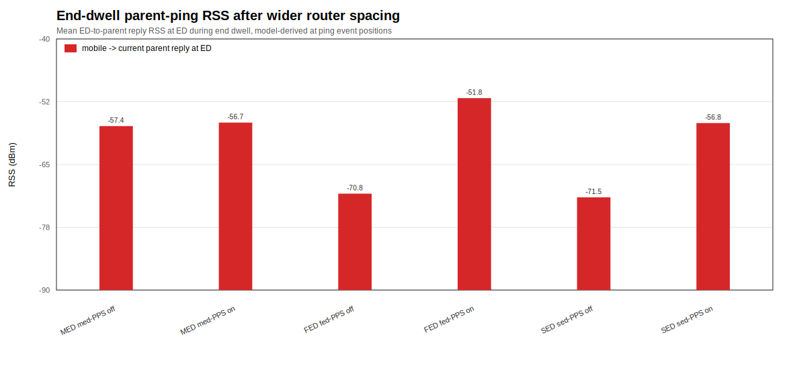

# Simple Scenario PPS Matrix

This page records the current repeated PPS-off/PPS-on matrix for the active
simple parent-switch scenarios. The active topology is a three-router, static
0 dBm topology with a fixed Router-A-only delay before Router B/C activation.

No MAPS policy or OpenThread parent-selection logic is implemented here.
PPS-off disables `OPENTHREAD_CONFIG_PARENT_SEARCH_ENABLE`; active PPS-on enables
it and sets `OPENTHREAD_CONFIG_PARENT_SEARCH_CHECK_INTERVAL=30`. This is tuned
stock OpenThread, not the upstream/default PPS interval.

## Scenario Geometry

All three active scenarios place Router A at `(350, 300)`, Router B at
`(875, 300)`, Router C at `(1400, 300)`, and create the mobile end device at
`(350, 360)`, close to Router A. Router A and the mobile are created first.
After a fixed 600 s Router-A-only delay, the runner introduces Router B and
Router C, monitors a 600 s post-activation settle period, and starts movement
from `(350, 360)` to `(1600, 360)`.

The start/end offsets are intentionally not symmetric. The left-side offset was
removed because it made initial Router A attachment unreliable as the endpoint
was pushed farther away. This version uses a fixed static delay near Router A
while still putting Router A under endpoint pressure.

Every node is configured to static `0 dBm` transmit power during node
initialization with the OpenThread CLI `txpower 0` command. The runner verifies
this with `txpower` when the CLI returns a value.

The scenarios assume OTNS `MeterPerUnit = 0.1`, so one coordinate unit is
treated as 0.1 m unless the radio parameter is overridden. The movement path is
1250 coordinate units, which is 125 m. With 25 one-second movement steps, the
target speed is 5 m/s. The mobile then dwells at the end for 600 seconds.

The active runner sends exactly one 1 Hz ICMP ping from the mobile end device
to its currently observed parent when that parent resolves to a known router.
With `--capture-sim-ping-rss`, the primary RSS field is
`mobile_to_parent_reply_rx_sim_rss_dbm`: parent reply RSS at the mobile ED. The
RSS source is `otns_model_derived_at_ping`, derived from the OTNS
`MutualInterference` model at the exact ping positions and using the configured
source TX power.

## Model RSS Check

Model-derived RSS with `0 dBm` TX power:

| Link | RSS (dBm) |
|---|---:|
| Router A -> mobile endpoint | -107.098 |
| Router B -> mobile endpoint | -98.075 |
| Router C -> mobile endpoint | -77.313 |
| Router A -> Router B | -92.649 |
| Router B -> Router C | -92.649 |

Router A is weak at the endpoint, Router C is a strong endpoint parent
candidate, and the A-B/B-C router links remain viable in the model.

## Artifacts

- MED PPS off: `results/med_simple_parent_switch_med-pps-off-repeated/20260713-013202-experiment/`
- MED PPS on: `results/med_simple_parent_switch_med-pps-on-repeated/20260713-013416-experiment/`
- FED PPS off: `results/fed_simple_parent_switch_fed-pps-off-repeated/20260713-013625-experiment/`
- FED PPS on: `results/fed_simple_parent_switch_fed-pps-on-repeated/20260713-013840-experiment/`
- SED PPS off: `results/sed_simple_parent_switch_sed-pps-off-repeated/20260713-014057-experiment/`
- SED PPS on: `results/sed_simple_parent_switch_sed-pps-on-repeated/20260713-014328-experiment/`

Each repeated artifact contains 10 CSV files, 10 summary JSON files, 10 replay
files, 10 replay metadata JSON files, node logs, `aggregate_summary.json`,
`repeated_run_manifest.json`, `manifest.json`, `README.md`, and one
representative dot RSS-over-time SVG. MP4 rendering was skipped for this
600/600/600 timing refresh because the longer static-delay replay rendering was
slow and the CSV/JSON/replay/RSS artifacts were sufficient for comparison.

## Aggregate Metrics

| Profile | PPS | Static delay (s) | Initial A | Pre-move switch | Switch rate | Mean switches | Mean 1st switch (s) | SD 1st switch | Mean outage (s) | SD outage | Mean PDR | SD PDR | Median end-dwell RSS (dBm) |
|---|---|---:|---:|---:|---:|---:|---:|---:|---:|---:|---:|---:|---:|
| MED | off | 600 | 10/10 | 0/10 | 7/10 | 0.7 | 1232.285714 | 4.070802 | 17.5 | 4.743416 | 0.99168 | 0.002261 | -77.313 |
| MED | on-30s | 600 | 10/10 | 0/10 | 10/10 | 1.4 | 1223.6 | 12.375603 | 77.8 | 185.743431 | 0.902219 | 0.283304 | -77.313 |
| FED | off | 600 | 9/10 | 1/10 | 7/10 | 0.8 | 1240.714286 | 31.186077 | 76.8 | 189.234599 | 0.899501 | 0.296544 | -94.802346 |
| FED | on-30s | 600 | 9/10 | 2/10 | 10/10 | 1.1 | 1262.5 | 109.29293 | 17.9 | 5.087021 | 0.993132 | 0.002674 | -77.313 |
| SED | off | 600 | 10/10 | 0/10 | 10/10 | 1 | 1232.5 | 2.877113 | 1.4 | 0.843274 | 0.98905 | 0.001757 | -77.313 |
| SED | on-30s | 600 | 10/10 | 0/10 | 9/10 | 0.9 | 1231.111111 | 3.407508 | 1.9 | 1.197219 | 0.990515 | 0.001288 | -77.313 |

## Parent Sequences

- MED PPS off: `7x router_a -> router_c`; `3x router_a`
- MED PPS on-30s: `4x router_a -> router_b -> router_c`; `3x router_a -> router_b`; `3x router_a -> router_c`
- FED PPS off: `4x router_a -> router_c`; `3x router_a`; `1x router_a -> router_b`; `1x router_a -> router_c -> router_b`; `1x router_c -> router_b`
- FED PPS on-30s: `8x router_a -> router_c`; `1x router_a -> router_b -> router_c`; `1x router_b -> router_c`
- SED PPS off: `10x router_a -> router_c`
- SED PPS on-30s: `7x router_a -> router_c`; `2x router_a -> router_b`; `1x router_a`

## Endpoint Parent Distribution

| Profile | PPS | Router A final | Router B final | Router C final | Unresolved final |
|---|---|---:|---:|---:|---:|
| MED | off | 3 | 0 | 7 | 0 |
| MED | on-30s | 0 | 3 | 7 | 0 |
| FED | off | 3 | 3 | 4 | 0 |
| FED | on-30s | 0 | 0 | 10 | 0 |
| SED | off | 0 | 0 | 10 | 0 |
| SED | on-30s | 1 | 2 | 7 | 0 |

Router A remained the final parent in 7 of 60 runs. The first movement sample
observed Router A in 58 of 60 runs. No run ended unresolved.

## Detach Recovery

| Profile | PPS | Detached/no reattach | Reattached new parent | Reattached same parent | No detach |
|---|---|---:|---:|---:|---:|
| MED | off | 0 | 5 | 0 | 5 |
| MED | on-30s | 0 | 7 | 1 | 2 |
| FED | off | 0 | 5 | 0 | 5 |
| FED | on-30s | 0 | 8 | 0 | 2 |
| SED | off | 0 | 10 | 0 | 0 |
| SED | on-30s | 0 | 9 | 0 | 1 |

The detached-no-reattach failure is now absent in the full 60-run matrix. Most
switches are still failure/recovery driven: the mobile detaches near the endpoint
and reattaches to a stronger parent, usually Router C.

## Parent Probe and Simulator RSS Metrics

Representative dot RSS-over-time plots are stored with each repeated artifact:

- MED PPS off: `results/med_simple_parent_switch_med-pps-off-repeated/20260713-013202-experiment/rss_over_time_run01.svg`
- MED PPS on-30s: `results/med_simple_parent_switch_med-pps-on-repeated/20260713-013416-experiment/rss_over_time_run01.svg`
- FED PPS off: `results/fed_simple_parent_switch_fed-pps-off-repeated/20260713-013625-experiment/rss_over_time_run01.svg`
- FED PPS on-30s: `results/fed_simple_parent_switch_fed-pps-on-repeated/20260713-013840-experiment/rss_over_time_run01.svg`
- SED PPS off: `results/sed_simple_parent_switch_sed-pps-off-repeated/20260713-014057-experiment/rss_over_time_run01.svg`
- SED PPS on-30s: `results/sed_simple_parent_switch_sed-pps-on-repeated/20260713-014328-experiment/rss_over_time_run01.svg`

MP4 rendering was skipped for this matrix because the added static delays make
the replay-to-video pass slow. Replay files remain available for every run.

## Interpretation

The longer static delays did not recover the attachment-gated `2/60`
Router-A-final behavior. Router A remained final in 7 of 60 runs, the same
count as the shorter `300/180/320` static-delay run but redistributed across
arms. The benchmark is therefore still not a near-guaranteed-switch setup.

The observed behavior is mostly endpoint failure recovery rather than a clean
mid-path A -> B -> C parent progression. Router C is the dominant final parent,
and Router B is only occasionally selected as an intermediate or final parent.

PPS-on improved switch rate for MED and FED under this timing, while SED PPS-off
was already `10/10`. Its value should be judged with outage, PDR, pre-movement
behavior, and parent sequence, not only switch rate.

SED packet delivery and parent-probe metrics remain secondary evidence because
regular SED ping behavior is not the primary attachment signal; parent-command
observation remains primary.

## Commands

The six repeated arms used `scripts/run_repeated_baseline.py` with
`--repeat-count 10`, `--capture-replay`, `--capture-sim-ping-rss`,
`--copy-results-to-artifact`, `--otns-watch-level trace`, the explicit PPS
binaries documented in [`pps_build_variants.md`](pps_build_variants.md), and
these scenario paths:

- `scenarios/med_simple_parent_switch.yaml`
- `scenarios/fed_simple_parent_switch.yaml`
- `scenarios/sed_simple_parent_switch.yaml`

FED runs used `--ftd-node-binary-path`; MED and SED runs used
`--node-binary-path`.

MP4 rendering was skipped for this timing refresh. Replay files can be rendered
later with `scripts/replay_to_mp4.py` if visual video evidence is needed.

## Limitations

- Ten runs per arm is still a small sample.
- Switch timing is dominated by endpoint dwell in most arms; the first switch
  normally appears after movement reaches the endpoint.
- Router B does not consistently appear as an intermediate parent.
- Router A remains final in 7 of 60 runs.
- Three runs switched before movement sampling: one FED PPS-off and two FED
  PPS-on-30s.
- Static-delay MP4 rendering was skipped because replay capture is sufficient
  and the longer fixed-delay replays make video rendering slow.
- SED packet delivery ratio is not primary evidence.
- FED uses OTNS's FTD executable family for both routers and the mobile FED.
- Simulator RSS is model-derived from OTNS `MutualInterference` at ping event
  positions because the exported replay/log artifacts do not expose receive
  RSS/LQI events for direct matching.
